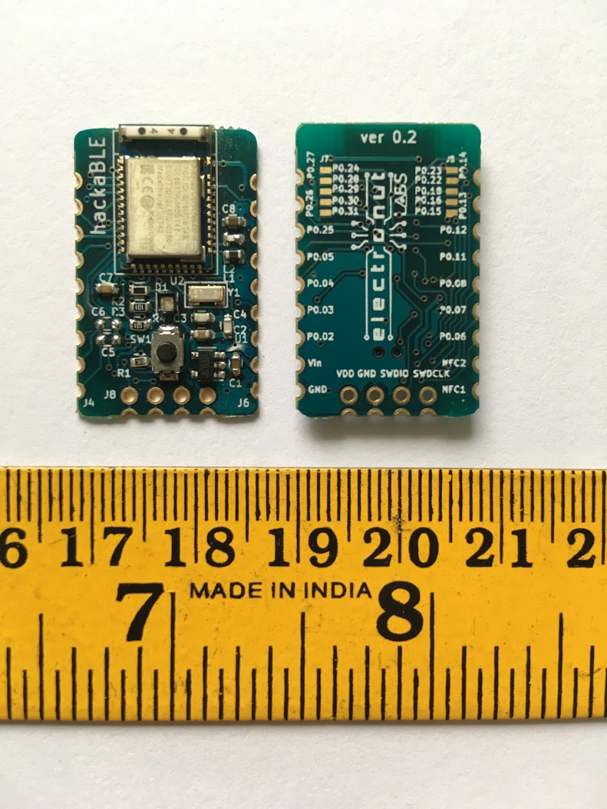
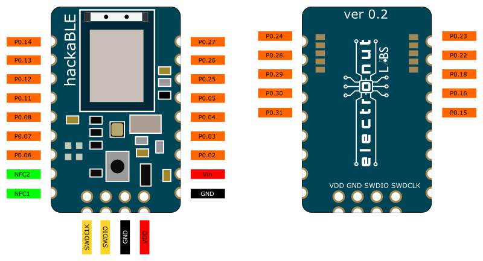

# hackaBLE

**hackaBLE** is a tiny (~ 18 mm x 28 mm) Open Source Nordic nRF52832 based BLE development board you can embed in your BLE projects. It's designed such that you can use it three ways:

- On a breadboard
- On a custom PCB, hand-soldered easily using the castellated 2.54 mm pitch headers
- On a custom PCB, using a stencil and oven, making use of extra pads underneath the PCB

hackaBLE uses offers more value than just using the BLE module directly - since it incorporates the necessary passive compoments - including the ones for the buck converter for power saving - and adds an RGB LED and a button for convenience. It's also much easier to solder than the bare modules. 

### Pinout for hackaBLE

## PCB Footprint for hackaBLE

...

## Programming hackaBLE

hackaBLE uses the Nordic nRF52832 which in turn is based on an ARM Cortex-M4 core. So you can really program it with any ARM compatible programmer. We do have a convenient solution though, in the form 
of our [Bumpy][3] blackmagic probe compatible SWD debugger and our [PogoProg][4]. 

As shown above, use the four SWD pins of PogoProg on hackaBLE to upload or debug hackaBLE.

Please [read the bumpy documentation][3] on using Bumpy to program hackaBLE.

For more details on nRF5 2programming, please read our guide on [getting started with Nordic nRF5 SDK][1].

## hackaBLE & Arduino

...

## Buy a hackaBLE!

hackaBLE is available for purchase from our [Tindie store][2]. Please email us at **info@electronut.in** if you have any questions.

[1]: https://github.com/electronut/ElectronutLabs-bluey/blob/master/nrf5-sdk-setup.md
[2]: https://www.tindie.com/stores/ElectronutLabs/
[3]: https://github.com/electronut/ElectronutLabs-Bumpy
[4]: https://github.com/electronut/ElectronutLabs-PogoProg
 
