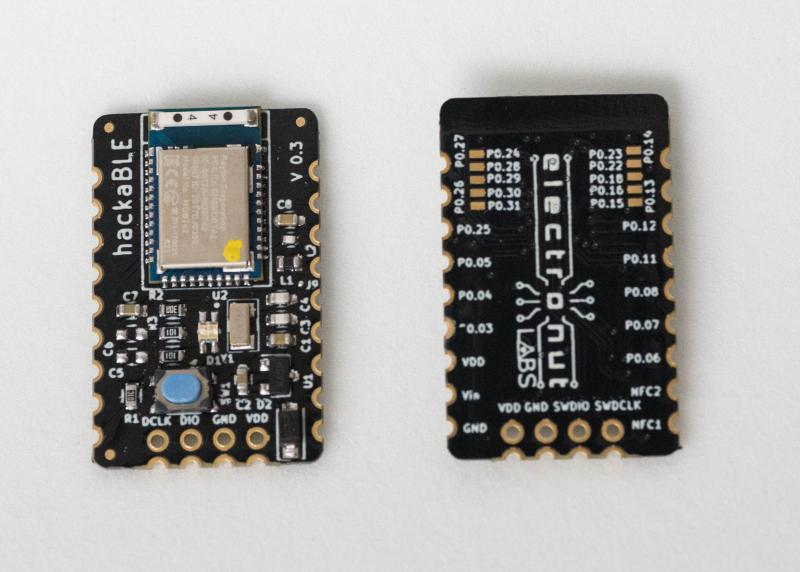
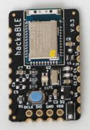
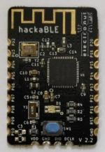
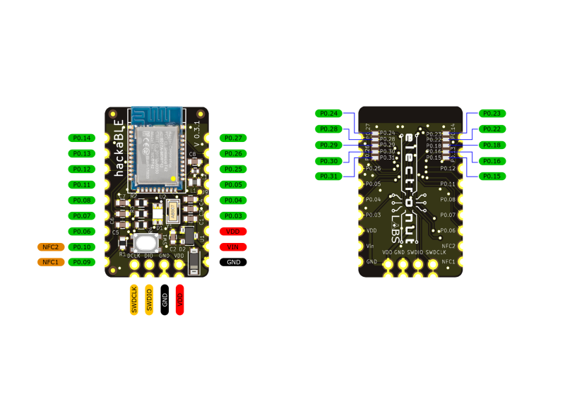
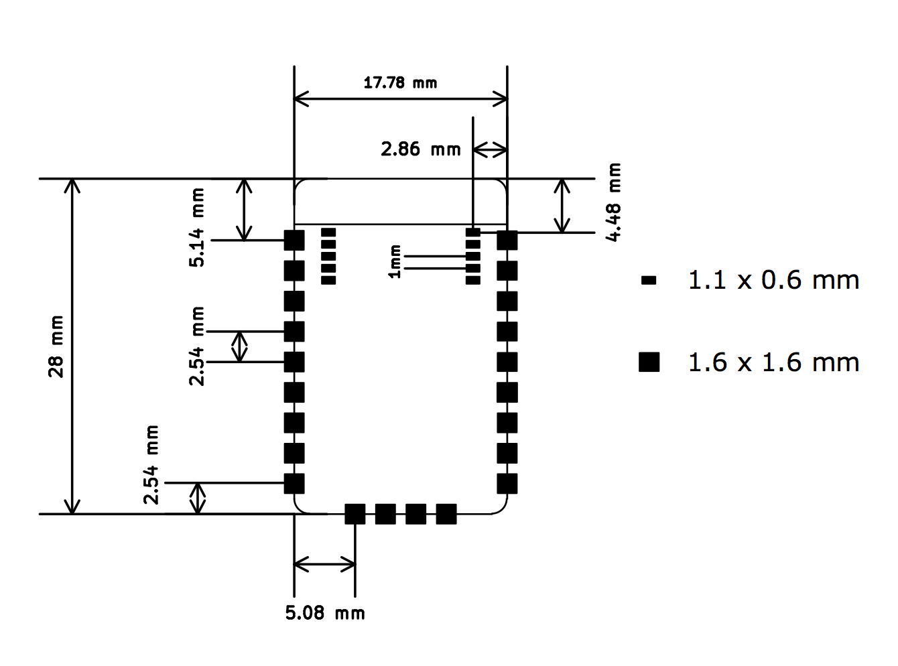
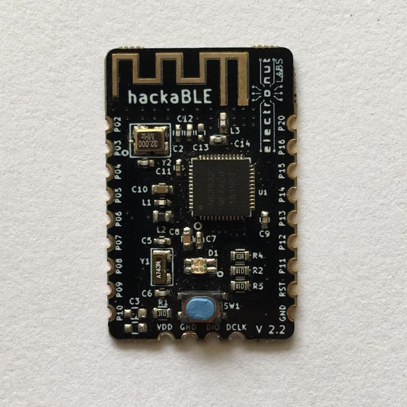
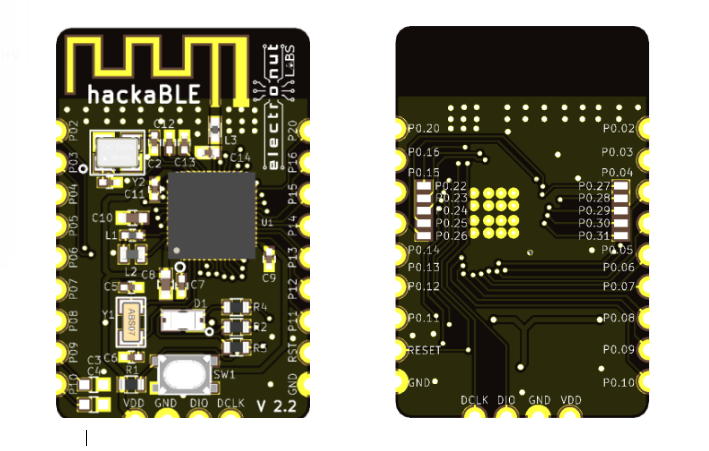

> **Note**: This repository has been moved to our GitLab page on May 2019, and will not receive any updates or be monitored. Please follow this link to go to the new repository: https://gitlab.com/electronutlabs-public/ElectronutLabs-HackaBLE

## What is hackaBLE ?

**hackaBLE** is a tiny (~ 18 mm x 28 mm) Open Source Nordic nRF52832 based BLE development board you can embed in your BLE projects. It's designed such that you can use it in three ways:

- On a breadboard
- On a custom PCB, hand-soldered easily using the castellated 2.54 mm pitch headers
- On a custom PCB, using a stencil and oven, making use of extra pads underneath the PCB

hackaBLE uses offers more value than just using the BLE module directly - since it incorporates the necessary passive components - including the ones for the buck converter for power saving - and adds an RGB LED and a button for convenience. It's also much easier to solder than the bare modules. 

**Features**

- Raytac MDBT42 based on Nordic Semiconductor's nRF52832 SOC with chip antenna
- RGB LED
- Button user configurable, set as RESET by default
- SWD programming headers
- MCP1702 3.3 V LDO
- Reverse current protection.

Currently, there are two versions available in the market. Select your version of hackaBLE from below and follow the documentation. 

<h3><a href="#hackaBLE_v0.3">hackaBLE v0.3</a></h3>

<h3><a href="#hackaBLE_v2.2">hackaBLE v2.2</a></h3>

<h2 id="hackaBLE_v0.3"></h2>

## hackaBLE v0.3

This is the latest version of hackaBLE it uses **Raytac's nRF52832 module** by Nordic Semiconductors. This version uses MCP1702, a 3.3 V voltage and protection diode at the input which enables hackaBLE to consume very low current and also provides reverse current protection. It also comes with an RGB LED, user reset button and SWD programming headers.  

### hackaBLE v0.3 pinout

### hackaBLE v0.3 PCB Footprint

### hackaBLE v0.3 Schematic and Datasheet

- [schematic](pcb/ver0.3/hackaBLE_Schematic.pdf)
- datasheet

<h2 id="hackaBLE_v2.2"></h2>

## hackaBLE v2.2

hackaBLE v2.2 is a redesigned hackaBLE that used the BLE SoC directly rather than a module. This version of hackaBLE also comes with an RGB LED, button, and SWD programming headers. It has onboard BLE antenna. 

**[CAUTION]** hackaBLE v2.2 does not come with a regulator since it's designed for low power applications. MAX input to VDD is 3.6 V.

### hackaBLE v2.2 pinout

### Schematic for hackaBLE v2.2

- [Schematic](pcb/ver2.2/hackaBLE.pdf)

## Programming hackaBLE

hackaBLE uses the Nordic nRF52832 which in turn is based on an ARM Cortex-M4 core. So you can really program it with any ARM compatible programmer. We do have a convenient solution though, in the form of our [Bumpy][3] Blackmagic probe compatible SWD debugger and our [PogoProg][4].

As shown above, use the four SWD pins of PogoProg on hackaBLE to upload or debug hackaBLE.

Please [read the bumpy documentation][3] on using Bumpy to program hackaBLE.

For more details on nRF52 programming, please read our guide on [getting started with Nordic nRF5 SDK][1]. 

### Program using Arduino IDE

hackable does not ship with a bootloader, but it is supported in Arduino. Please visit [here](https://github.com/electronut/ElectronutLabs-bluey#Arduino) for details (but select Hackable in the board's menu).

[Here's](https://electronut.in/using-hackable-with-arduino/) a blog article which will help you create a BLE custom characteristic and program it to hackaBLE using Arduino IDE.

For more detailed programming guide go [here](https://docs.electronut.in/hackaBLE/programming_guide/)

## Soldering headers hackaBLE

hackaBLE can be used on a breadboard. Here's a video that shows how to solder headers on to hackaBLE.

## Buy a hackaBLE!

hackaBLE is available for purchase from our [Tindie store][2]. Please email us at **info@electronut.in** if you have any questions.

[1]: https://github.com/electronut/ElectronutLabs-bluey/blob/master/nrf5-sdk-setup.md
[2]: https://www.tindie.com/stores/ElectronutLabs/
[3]: https://gitlab.com/electronut/ElectronutLabs-Bumpy
[4]: https://gitlab.com/electronutlabs-public/ElectronutLabs-PogoProg

## Code Repository

You can find all code and design files related to HackaBLE in this [repository](https://gitlab.com/electronutlabs-public/ElectronutLabs-HackaBLE).

## About Electronut Labs

**Electronut Labs** is an Embedded Systems company based in Bangalore, India. More 
information at our [website](https://electronut.in).

 
 
